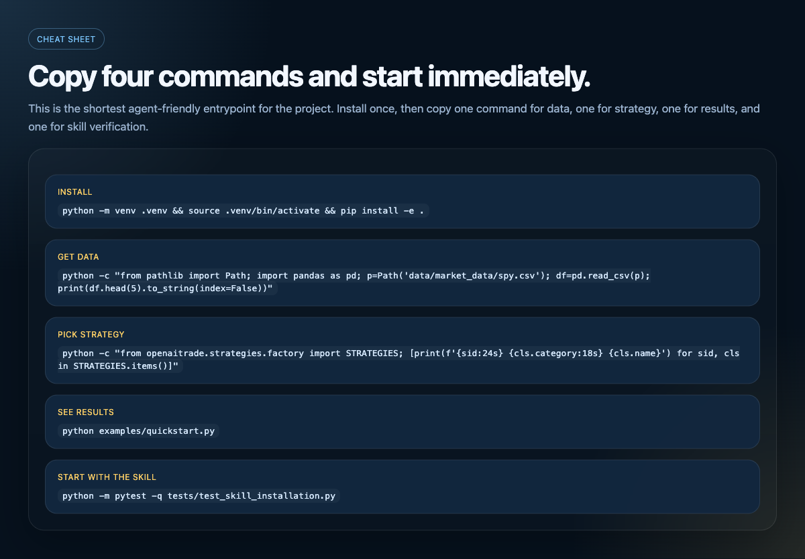

# OpenAITrade Public

Free data. Free strategies. Free workflow.

An agent-first quant research project built around `skill.md`.

This project is designed so that you start with the skill, not the whole codebase. The goal is to help users get results first, then go deeper only if needed.



## What Users Can See Immediately

### Get Data


Get real bundled sample market data in seconds.

```bash
python -c "from pathlib import Path; import pandas as pd; p=Path('data/market_data/spy.csv'); df=pd.read_csv(p); print(df.head(5).to_string(index=False))"
```

### Pick Strategy


Pick a built-in strategy before reading the full implementation.

```bash
python -c "from openaitrade.strategies.factory import STRATEGIES; [print(f'{sid:24s} {cls.category:18s} {cls.name}') for sid, cls in STRATEGIES.items()]"
```

### See Results


See a real backtest result before learning the whole framework.

```bash
python examples/quickstart.py
```

### Start With The Skill


Treat `skill.md` as the shortest path from idea to result.

```bash
python -m pytest -q tests/test_skill_installation.py
```

## Cheat Sheet

One-line install:

```bash
python -m venv .venv && source .venv/bin/activate && pip install -e .
```

Get data fast:

```bash
python -c "from pathlib import Path; import pandas as pd; p=Path('data/market_data/spy.csv'); df=pd.read_csv(p); print(df.head(5).to_string(index=False))"
```

Pick strategy fast:

```bash
python -c "from openaitrade.strategies.factory import STRATEGIES; [print(f'{sid:24s} {cls.category:18s} {cls.name}') for sid, cls in STRATEGIES.items()]"
```

See results fast:

```bash
python examples/quickstart.py
```

Start with the skill:

```bash
python -m pytest -q tests/test_skill_installation.py
```

## What You Can Do Quickly

With the public skill, an agent can help you:

- load free sample or external market data
- choose from built-in free strategies
- run a backtest quickly
- try parameter optimization on the same workflow

That is the main product message of this repository: use the skill first, inspect the code second.

## You Can Start Before Writing Code

The intended path is:

1. Load `skill.md`
2. Use free data
3. Pick a free strategy
4. Run a backtest
5. Run optimization
6. Read the implementation only if you want more depth

## 3-Minute Quickstart

One-line install:

```bash
python -m venv .venv && source .venv/bin/activate && pip install -e .
```

After install, one line to validate the public package:

```bash
python -m pytest -q
```

After install, one line each to do the main workflow:

Get data fast:

```bash
python -c "from pathlib import Path; import pandas as pd; p=Path('data/market_data/spy.csv'); df=pd.read_csv(p); print(df.head(5).to_string(index=False))"
```

Pick a strategy fast:

```bash
python -c "from openaitrade.strategies.factory import STRATEGIES; [print(f'{sid:24s} {cls.category:18s} {cls.name}') for sid, cls in STRATEGIES.items()]"
```

See backtest results fast:

```bash
python examples/quickstart.py
```

Start with the skill:

```bash
python -m pytest -q tests/test_skill_installation.py
```

Detailed copy-paste setup:

```bash
git clone <your-public-repo-url>
cd <repo>
python -m venv .venv
source .venv/bin/activate
pip install -e .
python examples/quickstart.py
python examples/optimize.py
```

If you want to validate the full public workflow:

```bash
python -m pytest -q
```

## Skill Installation And Verification

The `skill.md` flow has already been tested directly in the current directory.

Verified:

- relative paths referenced by the skill resolve correctly
- real sample data in the repository can be loaded
- strategies can be created through the strategy factory
- backtests can be executed through the backtest engine

Related validation:

- [tests/test_skill_installation.py](/Users/f/GitHub/OpenAITrade/public_release/tests/test_skill_installation.py)

If you want to exercise the minimum workflow advertised by the skill, run:

```bash
python examples/quickstart.py
python examples/optimize.py
```

## Who This Is For

- users who want an agent to help with strategy research quickly
- users who want free data and free strategies before adopting heavier tooling
- users who want backtesting and optimization without building infrastructure first
- users who want to package quant workflows as reusable skills

## Suggested Reading Order

1. Start with [skills/openaitrade/SKILL.md](/Users/f/GitHub/OpenAITrade/public_release/en/skills/openaitrade/SKILL.md)
2. Then read [docs/STRATEGIES.md](/Users/f/GitHub/OpenAITrade/public_release/en/docs/STRATEGIES.md)
3. Then run `examples/quickstart.py`
4. Then run `examples/optimize.py`
5. Then inspect the shared code layer if needed

## Shared Core

The Chinese and English entrypoints share the same code and research assets:

- [../openaitrade/data](/Users/f/GitHub/OpenAITrade/public_release/openaitrade/data) for free data access
- [../openaitrade/strategies](/Users/f/GitHub/OpenAITrade/public_release/openaitrade/strategies) for free strategies
- [../openaitrade/backtest](/Users/f/GitHub/OpenAITrade/public_release/openaitrade/backtest) for backtesting
- [../openaitrade/tools](/Users/f/GitHub/OpenAITrade/public_release/openaitrade/tools) for optimization
- [../data/market_data](/Users/f/GitHub/OpenAITrade/public_release/data/market_data) for sample data
- [../strategy_packs](/Users/f/GitHub/OpenAITrade/public_release/strategy_packs) for structured workflow assets

## Directory Structure

```text
en/
├── README.md
├── docs/
└── skills/
```

This English directory is mainly responsible for:

- giving public users an agent-first entrypoint
- helping skill users start with the shortest path
- making the free data, free strategies, and free workflow message clear

## Project Positioning

This is not a full public mirror of the private product. It is a reusable public subset focused on:

- free data
- free strategies
- an agent-friendly workflow centered on `skill.md`
