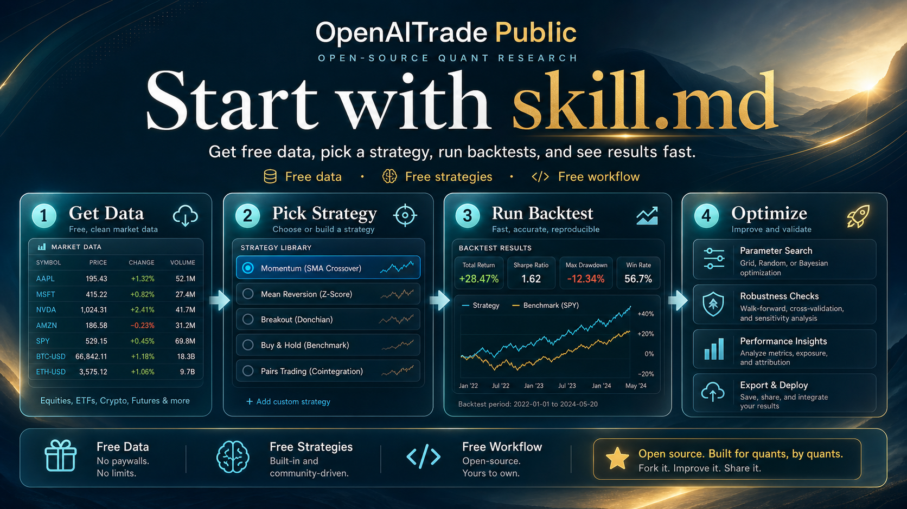

<p align="center">
  
</p>

<h1 align="center">OpenAITrade</h1>

<p align="center">
  
</p>

Start with `skill.md`. Get data, pick a strategy, run a backtest, and see results fast.

Free data. Free strategies. Free workflow.

<p align="center">
  
</p>

## For Humans

Copy and paste this to your LLM agent:

```text
Use this repository as an agent-first quant workflow.

Start Now
Install:
python -m venv .venv && source .venv/bin/activate && pip install -e .

Get data fast:
python -c "from pathlib import Path; import pandas as pd; p=Path('data/market_data/spy.csv'); df=pd.read_csv(p); print(df.head(5).to_string(index=False))"

Pick strategy fast:
python -c "from openaitrade.strategies.factory import STRATEGIES; [print(f'{sid:24s} {cls.category:18s} {cls.name}') for sid, cls in STRATEGIES.items()]"

See results fast:
python examples/quickstart.py

Start with the skill:
python -m pytest -q tests/test_skill_installation.py
```

If you want to read first, keep going. If not, let your agent do the setup and validation for you.

## For LLM Agents

Start Now

Install:

```bash
python -m venv .venv && source .venv/bin/activate && pip install -e .
```

Get data fast:

```bash
python -c "from pathlib import Path; import pandas as pd; p=Path('data/market_data/spy.csv'); df=pd.read_csv(p); print(df.head(5).to_string(index=False))"
```

Pick strategy fast:

```bash
python -c "from openaitrade.strategies.factory import STRATEGIES; [print(f'{sid:24s} {cls.category:18s} {cls.name}') for sid, cls in STRATEGIES.items()]"
```

See results fast:

```bash
python examples/quickstart.py
```

Start with the skill:

```bash
python -m pytest -q tests/test_skill_installation.py
```

## You Get

- Free bundled sample market data
- Free built-in strategies
- A backtest engine you can use immediately
- A parameter optimization workflow
- A `skill.md` entrypoint that ties the whole flow together

## What You Can See Immediately

### Get Data


Get bundled sample market data in seconds.

### Pick Strategy


Pick a built-in strategy before reading the full implementation.

### See Results


Run a real backtest and inspect the result immediately.

### Start With The Skill


Use `skill.md` as the fastest path from idea to result.

## Start Here If You Want Results First

1. Load `skill.md`
2. Use free data
3. Pick a strategy
4. Run a backtest
5. Try optimization
6. Read the code only when you want more control

## Verify Fast

Validate the public package:

```bash
python -m pytest -q
```

Validate the skill flow in the current directory:

```bash
python -m pytest -q tests/test_skill_installation.py
```

The tested skill flow already covers:

- resolving skill-relative paths correctly
- loading real bundled sample data
- creating strategies through the factory
- running backtests through the backtest engine

## Use This For

- test a strategy idea quickly with an agent
- try free data and free strategies before paying for tooling
- run backtests without building infrastructure first
- package a quant workflow as a reusable skill

## Find Things

- [../openaitrade/data](../openaitrade/data): free data access
- [../openaitrade/strategies](../openaitrade/strategies): free strategies
- [../openaitrade/backtest](../openaitrade/backtest): backtesting
- [../openaitrade/tools](../openaitrade/tools): optimization
- [../data/market_data](../data/market_data): bundled sample data
- [../strategy_packs](../strategy_packs): structured workflow assets

## Go Deeper

- [skills/openaitrade/SKILL.md](skills/openaitrade/SKILL.md)
- [docs/STRATEGIES.md](docs/STRATEGIES.md)
- [docs/BACKTESTING.md](docs/BACKTESTING.md)
- [docs/LIVE_TRADING.md](docs/LIVE_TRADING.md)
